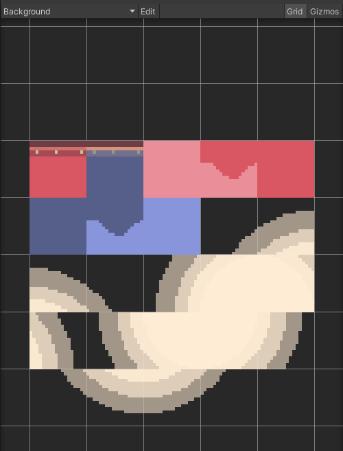

# Generación de Tile maps.
## Autor: Álvaro González Rodríguez
alu0101202556

1. Obtener assets que incorpores a tu proyecto para la generación del mapa: planos e isométricos.

Para el mapa rectangular se está utilizando los assets gratuitos de PolyMeshWorld y para el isométrico el Isometric Mediaval Pack

2. Generar al menos 2 paletas para crear un mapa rectangular.

La paleta 1 se utiliza para el fondo, mientras que la paleta 2 se utiliza para las plataformas, por lo que esta última tiene los componentes necesarios para las colisiones con el jugador

3. Crear un mapa isométrico.

Se han tenido que definir nuevos Layers para ordenar como se van a renderizar los distintos componentes. Los primeros que se renderizan son los bloques del suelo, luego las paredes y por último los elementos de decoración

4. En el mapa convencional, incluir obstáculos y paredes.

5. En el mapa isométrico generar zonas elevadas y obstáculos.

6. Seleccionar sprites para usar como decoración y sprites animados para usar como personaje y como enemigos e incorporarlos al juego.

Se han utilizado prefabs del jugador y goblin que ya se utilizaban en el mapa convencional para añadirlo al mapa isométrico

7. Controlar mediante scripts al menos dos transiciones de animación en el personaje y una de un enemigo

Las transciciones están más cuidades en el mapa convencional, donde el juagdor puede ir del estado idle al caminar, atacar o morir. El enemigo zombie pasa del estado idle a muerto si se chocan con el y el goblin de idle, atacar si se le choca y muerto si se le ataca
